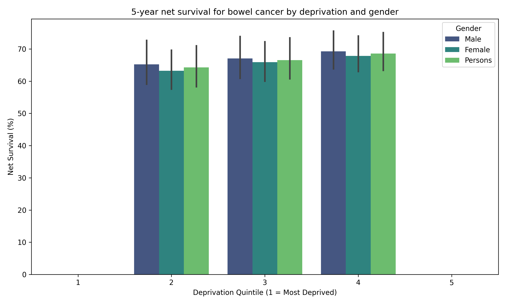

# Colorectal Cancer Survival Analysis 🩺📊

## Why This Matters  
Cancer survival isn’t just about biology, it’s deeply linked to where people live, their social conditions, and access to care. This project digs into how **socioeconomic status** impacts 5-year survival rates for colorectal (bowel) cancer in England. Spoiler: deprivation really matters.

## What I Did 💻  
Using publicly available data from NHS England (2016–2020), I cleaned, filtered, and visualized survival rates across deprivation groups, breaking it down by gender to uncover hidden inequalities. This project helped me sharpen my skills in data wrangling and storytelling through visuals

## The Data 📂  
- NHS England’s National Cancer Survival Statistics 
- Focused on colorectal cancer cases only
- Survival rates segmented by deprivation quintiles (1 = most deprived, 5 = least deprived) and gender

## Chart 📊 

## Key Takeaways 💡  
- Survival improves as deprivation decreases — meaning social factors can affect your chances of beating cancer
- Women tend to survive slightly better than men across all deprivation levels  
- These insights highlight the urgent need for targeted public health strategies to reduce disparities

## What You’ll Find Here 📁  
- A clear bar chart showing survival differences by deprivation and gender 
- The cleaned Excel dataset I worked with 
- The Python notebook/Colab script with all the code, step-by-step 

## Why You Should Care 💬  
Understanding these disparities is crucial if we want to create fairer health outcomes. Data isn’t just numbers — it tells stories, and this one demands action.
